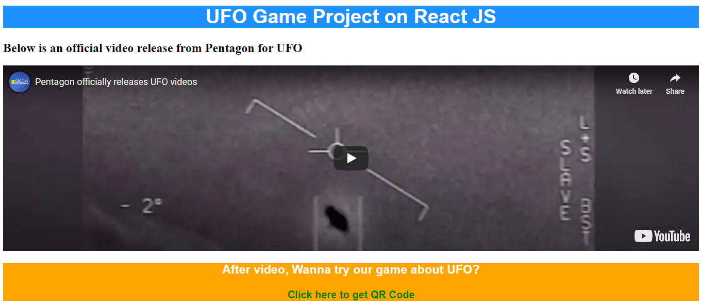

# REACT_Project
A project for EC500 about Web and App.          
1. A webpage in React for displaying video about actual UFO.       
2. An App for playing UFO game in React Native.       
    
Recently, here is an explosive news about UFO, "Pentagon officially releases UFO videos". Video can be viewed [here](https://www.youtube.com/watch?v=mW9g_gx2BqM)      
As a team interested in this kind of news, we would like to attract more people to pay attention on this. We created a webpage to show videos about UFO, then when people are interested in UFO, they can scan our QR code to play the game made in React Native. Hope this project will be interesting for people.     

## Video Demo    
 is a video demo for our project.     

## Image Gallery    
Below is the image for UFO video webpage.     
    
Below is the image for UFO game App.      
     

## User Story     
1. As **a fan of alien stuff**, I want to know more abut UFO through video(s) since video has a bunch of introductions and images which can help me understand more.    
2. As **a normal person who has no idea about UFO**, a brief video will be enough for me and I would be appreciated if I can play a small game on phone which can help me not too nervous.     
3. As **a developer who has interests in React and React Native**, I would like to learn video player in React-web and how to build game in React Native.    

## Set up     
Download our project.    
```
git clone https://github.com/zhou-1/GameOnReactAndReactNative.git
```
Go into the React Web folder and type the following command to install all npm packages.    
```
npm install -g create-react-app
```
In order to run the application Type the following command    
```
npm start
```
The Application Runs on localhost:3000      
Then you can also access to phone App through QR code in webpage.     


## Minimum Valuable Product    
- Video Player in ReactJS     
Displayed a video player in ReactJS. This component is used to fluently display video(s) in any link especially for Youtube video.     
- Hide & Show function in ReactJS     
Built a function to hide and show title and image. This component is used to hide QR code if people have no interests in Game but only video.    
- HTTP client in ReactNative     
Used axios library to make HTTP Calls.           
- Simulate gravity function    
Built a simulate gravity function for bird. Initially we give a gravity to UFO, it will drop down because of gravity; every click will decrease the gravity temporarily which causes bird to fly up.       
- Automatic generate obstacle function    
Created a program that generate obstacles automatically. Obstacle's size and place are random which is determined by our program.       
- Collision response
When collision between ufo and enemies happens the motion of the ufo will change which make the game harder than it seems, even though you may have many lives left, game may over because of bouncing between two obstacles.
- More intersting feature
Now it's easy to add more interesting features to the game while still need more time to figure out what can make the game fancier!


## Tech     
React    
ReactNative  
React-native-game-engine   
Axios   
JavaScript     
matter-js   
  
  

